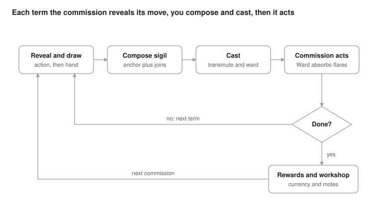
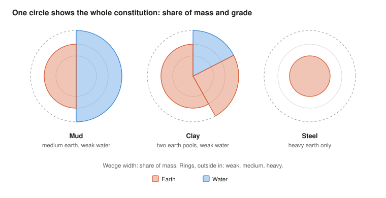
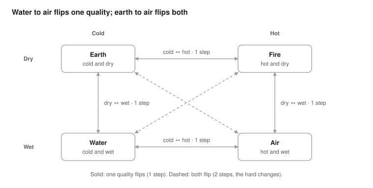

# Circumgician Deckbuilder — Design Doc

Last updated Oct 9, 2026. Started Oct 7, 2026.

## Overview

A roguelike deckbuilder in the spirit of Balatro: each term you compose sigils from the runes in your hand until it is spent, and each encounter is an alchemical transmutation. Every term makes the work more unstable, and the run ends when you can no longer pay quintessence to hold it together.

**Design pillars**

- **Every hand is a composition.** Players build a structure by circumscribing, inscribing, side-linking and entwining, rather than matching a set.
- **Runes are what they hold.** A rune's body sets its power, links and bowls; the motes in its bowls give it an element and abilities. Upgrading a rune means changing what it holds.
- **Upgrades compound.** Motes and new runes stack across a run toward big, readable payoffs.
- **Hit the target, and make plenty.** Each commission asks for a specific constitution, so overshooting is a risk, but more product earns more. This is the main departure from Balatro.
- **Alchemy you can reason about.** Elemental changes follow one consistent logic, so players can predict which changes are cheap.
- **Symmetry is stability.** A sigil's shape decides how well it holds the work together, and each class relates to that differently.
- **Familiarity pays.** Each source material attacks in a consistent, learnable way; targets supply the variety.

## Glossary

| Term | Meaning |
| --- | --- |
| Rune | A card in the deck: a body holding motes in its bowls. |
| Body | A rune's shape: circle, crescent or triangle. It sets power, links and bowls. |
| Bowl | A slot on a body that holds one mote. |
| Mote | What gives a rune its nature. Gems set the element; ability motes add links, multiply Reach or add Ward. Earned motes fill or replace bowls to upgrade a rune for the rest of the run. |
| Power | A rune's strength, set by its body. Each join turns it into Force, Reach or Ward. |
| Links | How many runes a rune holds when it anchors a sigil. |
| Sides | A count per body: circle 1, crescent 2, triangle 3. Tracked in the prototype as a candidate balance measure. |
| Sigil | One cast: an anchor plus joined runes, up to the anchor's links. A term can hold several. |
| Anchor | The rune a sigil is built from; its element is the source of the change. |
| Join | How a rune attaches to the anchor: circumscribe, side link, entwine or inscribe. Each does something different. |
| Table (leaning) | The diagram that collects every sigil cast in a commission; balance is measured from it. |
| Class | A deck family defined by symmetry: Regular, Isosceles or Scalene. Parked while bodies and motes settle. |
| Elemental | One of the four classical elements: Earth, Water, Air, Fire. |
| Amalgam | The substance being worked, shown as one circle. Its constitution is the share and grade of each elemental. |
| Pool | One elemental at one grade within the amalgam, such as 3 kg of weak earth. An elemental can hold several pools. |
| Weight | How much of a pool the amalgam holds, in kg. |
| Grade | How hard a pool is to change: weak, medium, heavy, or inert for bosses. |
| Yield | Kg produced per kg changed, set by the from→to pair. |
| Change-inertia | Umbrella for how hard a change is (grade) and how much results (yield). |
| Condensing | Transmuting an elemental into itself, raising its grade at a cost in mass. |
| Commission | One encounter: a source material (the opponent) to transmute into a target material (the puzzle). Balatro's blind. |
| Action pool | A source's weighted set of moves; one is rolled and revealed each term. |
| Flare | A burst of instability from the commission. Ward absorbs part; the rest costs quintessence. |
| Ward | A sigil's defensive output, from entwines and guard motes. Ward from every sigil in a term adds up. |
| Quintessence | The run's life, spent only to stabilize. The run ends when it runs out. |
| Byproduct | A split lump tethered to the main amalgam; it vanishes when the main amalgam is done. |
| Required lump | A split lump that must reach a stable state before the commission can finish. |
| Stable state | Any named substance, such as clay or dross. A lump that reaches one is settled. |
| Term | One cycle: the commission reveals its action, the player casts as many sigils as the hand allows, then ends the term and the commission acts. |
| Currency (name open) | What the workshop takes; earned from commissions in proportion to product made. |
| Reach, Force, Vector, Ward | A sigil's four outputs: kg it can affect, inertia it can overcome, the from→to change, and defence. |
| Apparatus (proposed) | Passive run modifiers in limited slots, such as an athanor or alembic. Balatro's jokers. |

## Core loop

A run is a chain of commissions. Each commission repeats terms until it is done. Within a term the player casts as many sigils as the hand allows, and the commission acts only when the term ends.

1. The commission rolls an action from its pool and reveals it.
2. Draw up to hand size (prototype: 6 runes).
3. Compose a sigil: an anchor plus joined runes, up to the anchor's links. Or spend a discard to redraw.
4. Read the preview: the sigil's Reach, Force, Vector and Ward against the selected pool, and what ending the term after it would cost.
5. Cast. The sigil resolves at once: the amalgam changes, mote and apparatus effects trigger, its Ward adds to the term's, and it stays on the table. If the amalgam now meets the target, the commission is done.
6. Compose and cast again while runes remain, or end the term.
7. End the term. The commission acts: the term's Ward absorbs part of any flare and the rest is paid in quintessence; disruptions hit the table. Unplayed runes stay in hand; played runes go to the discard pile.

A commission is done when the main amalgam meets the target and every required lump is stable. Rewards scale with the product made, so overkill pays and a poor commission still makes progress. Between commissions the player attaches motes, takes new runes and spends currency at the workshop.



Running out of quintessence ends the run.

## Runes: bodies and motes

A rune is a body holding motes. The body sets power, links and bowls; the motes in its bowls give the rune its element and abilities, so upgrading a rune means changing what it holds. Values are the prototype's starting points, all editable in its sandbox.

| Body | Power | Links | Bowls | Sides |
| --- | --- | --- | --- | --- |
| Circle | 5 | 1 | 1 | 1 |
| Crescent | 5 | 1 | 2 | 2 |
| Triangle | 5 | 1 | 3 | 3 |

| Mote | Effect |
| --- | --- |
| Basic sapphire | Water |
| Basic emerald | Earth |
| Basic topaz | Air |
| Basic ruby | Fire |
| Link mote | +1 link |
| Reach mote | The sigil's Reach ×1.5 |
| Guard mote | +4 Ward |

**Standard starting deck: 14 runes.** It should handle an easy commission with some difficulty.

- **8 circles,** two of each element: the plain workhorses.
- **4 crescents,** one of each element, each with a link mote: they show how a rune gains links.
- **2 triangles** with a link, a reach and a guard mote, and no element. Anchored, they make a pure defence sigil; joined, they bring Reach ×1.5 and +4 Ward.

**Links count only on the anchor.** A circle anchor makes a two-rune sigil; a crescent or triangle anchor makes three. The prototype first treated links as connections, so a 2-link rune anywhere carried the sigil one step deeper. Every crescent and triangle became a free extender, and a simulated player built five- and six-rune sigils that finished mud in one term.

A rune's element is its first gem; a rune without a gem has no element. Mote abilities apply wherever the rune sits in a sigil.

## Sigil composition

Leaning: each play is a floating sigil, an anchor plus joined runes up to the anchor's links, and each join turns the joined rune's power into something different.

| Join | Effect (prototyped) | Feel |
| --- | --- | --- |
| Circumscribe | Power as Force; the outermost circumscribed rune's element is the target | Multiplicative, like Balatro's mult |
| Side link | Power × 0.2 kg of Reach | Additive, like Balatro's chips |
| Entwine | Power as Ward | Defence |
| Inscribe | Power as Force; condenses if it matches the anchor's element, otherwise halves Reach for fine control | Precision |

The anchor adds its power as Force and power × 0.2 kg of Reach. Kilos converted = Reach × Force ÷ the Force the change needs, so Force past the requirement multiplies Reach. The original formula capped Force at the requirement; under the cap, the standard deck won only half its commissions against mud in simulation.

**Few, large sigils.** A term lasts until the hand is spent or the player ends it. Reach and Force multiply, so runes are worth more in one sigil than spread across several. The same six power-5 runes, a Water anchor working weak water into earth:

| Six runes cast as | Water moved |
| --- | --- |
| Three 2-rune sigils | 6 kg |
| Two 3-rune sigils | 8 kg |
| One 5-rune sigil, one rune left over | 9 kg |
| One 6-rune sigil | 12 kg |

Links therefore compound, and the expected play is one or two high-link sigils a term. A rune left out, or a stray warding sigil made from leftovers, is fine; nothing needs to use up every rune. Traces still suit small sigils, since one basic sigil already moves about 1 kg of a 2 kg trace.

**Rules**

- The anchor's element is the source of the change; the player selects which pool, and which lump, it works on.
- Inscribing a rune of the anchor's own element condenses the selected pool one grade.
- Chained circumscribes route around the elemental square: an Earth anchor circumscribed by Water, then Air, takes two easy steps instead of one hard jump. That needs an anchor with two links.
- Runes with no element add their power without changing the route.

**Example plays**

| Sigil | Result |
| --- | --- |
| Circle anchor + circumscribe | The basic transmute |
| Crescent anchor + circumscribe + entwine | Progress with some Ward |
| Crescent anchor + circumscribe + side link | More kilos, no Ward |
| Triangle anchor + two entwines | All-out defence: Ward 14, no change |
| Anchor + inscribe of its own element | Condense |

**Stabilizing patterns.** Entwines and guard motes give Ward directly. Balance across the table can add to it: whole-table symmetry, and opposites joined together, Earth with Air or Water with Fire.

## The table (leaning)

Sigils don't vanish after a term. Each one takes effect, then joins a growing diagram that records the whole commission, and ideals like balance are calculated from what is actually on it.

- **The table is the vessel circle.** It has a boundary, so running out of room becomes its own pressure.
- **Balance must be legible.** It comes from a few properties players can judge by eye, such as mirror symmetry, opposite pairs and filled quadrants, never an opaque geometric score.
- **Commissions attack the table.** Disruptions unravel joins, slide sigils, scorch runes or lock them in place, so defence is partly spatial. Entwined sigils resist displacement.
- **Imbalance feeds instability.** In the prototype, runes on the table are tallied Earth against Air and Water against Fire, and every 2 points of imbalance past the first 2 add 1 instability a term.
- **Which measure of balance is open.** The prototype tracks three on the table and across the commission: runes by element, elemental motes, and sides (circle 1, crescent 2, triangle 3), alongside how many of each body were played. Strain still counts runes.

## Classes

**Parked.** The prototype uses bodies (circle, crescent, triangle) in place of polygons, so how symmetry classes map onto bodies and motes is open. The proposal below predates bodies.

Three classes give distinct play paths, defined by the symmetry of their polygons. Symmetry is stability, so each class has a different relationship to instability.

| Class | Shapes | Identity (proposed) | Join aptitude and stability (proposed) |
| --- | --- | --- | --- |
| Regular | Regular polygons; many axes of symmetry | Steady: wards cheaply but progresses slowly | Entwines well; symmetric placements come easily |
| Isosceles | One axis of symmetry | Directed: precise routes and fine yields, the Vector class | Side-links well; stabilizes by pairing mirrored shapes base to base |
| Scalene | No axis of symmetry | Volatile: hits hardest; some elements grow stronger as instability rises | Circumscribes well; rarely wards, so it pushes progress and pays quintessence |

Runes from other classes are sometimes offered, and taking them isn't always good. The cost comes from existing rules rather than a penalty: a scalene rune breaks a regular sigil's symmetry, while a regular rune gives a scalene deck a stable anchor. Off-class runes also dilute the draws a class depends on, such as isosceles pairs.

## Deck progression

Runes improve by changing what their bowls hold; the deck grows by earning new runes and, proposed, shrinks by dissolving them.

- **Motes.** Earned motes go into empty bowls or replace what a bowl holds, for the rest of the run. Gems change the element; ability motes add links, multiply Reach or add Ward; later motes can add triggers such as "retrigger when inscribed". Bowls are scarce, so placement is a decision.
- **Bodies (proposed).** A body upgrade could add a bowl or power, so a circle grows into something that holds more.
- **New runes.** Earned from commission rewards or bought in the workshop, in rarity tiers. Runes from other classes appear only sometimes.
- **Currency.** The workshop takes an ordinary currency (name open), earned from commissions in proportion to product made. Quintessence is never spent here.
- **Dissolving (proposed).** Retire a rune and recover its motes. Thinning lets players focus a deck, and recovering motes makes it feel like a gain.
- **Formulae (proposed).** Consumables that level up a join type, like Balatro's planet cards.
- **Apparatus (proposed).** Passive modifiers in limited slots, like Balatro's jokers, named for alchemical vessels. Examples: an athanor that adds Force to changes ending in Fire; an alembic that raises Water→Air yield.

## Power arc

By the end of a run the player should crush the commissions that once pushed them: mud to clay in one term, two at most, or played on at leisure to make far more clay than the mud held. The prototype's late-run deck does both.

**Targets**

- A run is 20 or more commissions, and difficulty rises and falls rather than climbing steadily (see Run structure).
- Late in a run, mud to clay takes one term, two at most.
- Or the player plays around, generating huge amounts of new mass before finishing.

**Measured in the prototype.** Three decks stand for points along a run. Each keeps the standard 14 runes and upgrades a few, about one upgrade per commission. Simulated, 100 commissions each:

| Deck | Upgrades | Hand | Median terms | Done in 1 term | In 2 or fewer | Quintessence spent (median) | Clay made |
| --- | --- | --- | --- | --- | --- | --- | --- |
| Opening | 0 | 6 | 6 | 0% | 0% | 5 | 35 kg |
| Mid-run | About 10 | 7 | 3 | 0% | 17% | 0 | 54 kg |
| Late-run | About 20 | 8 | 1 | 59% | 99% | 0 | 91 kg |
| Late-run, 10-rune hand | About 20 | 10 | 1 | 91% | 100% | 0 | 106 kg |

Mid-run, each crescent becomes a triangle with two link motes, so it anchors four-rune sigils. Late-run, triangles hold six bowls, and each elemental triangle carries four link motes and a reach mote, so it anchors six-rune sigils.

**Ring chains are the mass engine.** A chain of circumscribes that loops back to the anchor's element multiplies the yields along it: earth → air → fire → earth is 20 × 1 × 2 = ×40. One late sigil, an earth anchor ringed by air, fire and earth with a side link, turned 2.7 kg of earth into 108 kg and finished mud as 145 kg of clay. The new earth dilutes the traces into their band, so one cast fixes everything. A loop needs three rings, so it opens only once an anchor holds three links. A simulated player that held off finishing grew the late deck's clay to 440 kg, 11 times the mud, in a median 7 terms for 2 quintessence.

**The opening deck can't overkill.** Asked to finish with even 41 kg of clay, 1 kg more than the mud held, the planning player lost 98% of commissions, bleeding quintessence over 24 terms. Chasing mass alone, it grew the amalgam to as much as 247 kg, but over three quarters of it was air from earth → air at ×20. Without three-ring loops, every gain lands as the wrong element, and three air runes with small Reach can't turn 100 kg of air back into earth before the stock runs out.

**Levers**

- **Hand size moves one-term finishes most.** Finishing takes a bulk sigil plus trace fixes, so the right runes must be in hand together. With every rune given four extra links, one-term finishes rose from 42% with a 6-rune hand to 85% with 8 and 96% with 10.
- **Links open chains, then level off.** Six extra links did no better than four.
- **Raw power hurts precision.** Power 8 instead of 5 cut one-term finishes from 85% to 52%, because the smallest sigil then overshoots a 2 kg trace. Fine tools must grow with power.
- **The counter-curve** is later commissions' weight and grade: heavy ×2 and inert ×4 raise the Force every change needs.
- **Greed is cheap so far.** Flares rising by 1 a term barely tax a long commission. If extra product should carry risk, escalation needs teeth.

## Challenge system: transmutation

Each commission is an amalgam to bring to a target constitution. Difficulty comes from how much there is (weight), how hard each pool is to change (grade), and how many elementals must be steered at once. Mud, as prototyped:

| Pool | Weight | Grade | Share |
| --- | --- | --- | --- |
| Earth | 18 kg | Medium | 45% |
| Water | 18 kg | Weak | 45% |
| Air | 2 kg | Medium | 5% |
| Fire | 2 kg | Medium | 5% |

**Traces matter.** Real mud holds organics, and where there are organics there is air and fire. With two-element mud, air and fire runes had nothing to do but defend. Traces give every element a job, and they must be steered into narrow bands, not simply removed. At medium grade, one basic circle sigil removes about 1 kg and lands inside the band; a careless second one wipes the trace out. In simulation, traces add about one hand size of difficulty, and air and fire runes are played nearly as often as water and earth.

Change-inertia splits in two: the from→to pair sets yield, and the source pool's grade sets resistance.

**The amalgam is one circle, not four bars.** Wedge width shows each elemental's share of mass, and heavier grades sit nearer the center, so mixed pools show as a stepped edge. The target is a ghost silhouette on the same circle, and the amalgam takes a substance's name, such as clay, when it enters that region. Every named substance is also a stable state for split lumps.



The clay holds two earth pools: the original medium earth and the weak earth made from water, which shows as the step in its edge.

**Targets are proportions plus quantity.** Clay is 75–85% earth, with air and fire each strictly between 1% and 3%, any grade; steel needs heavy earth. Off-spec amalgams take their own names: organic clay when the traces run high, lean clay when they run out. Final quantity matters: more product earns a bigger reward.

**Resistance from the elemental square (proposed).** Classical theory gives each elemental two qualities: Earth is cold and dry, Water cold and wet, Air hot and wet, Fire hot and dry. Flipping one quality is a 1-step change and flipping both is a 2-step change, so water to air is easier than earth to air.



Each side of the square keeps one quality, so crossing it is a 1-step change; the diagonals, such as Earth to Air, are the 2-step changes.

Proposed base resistance: 10 for a 1-step change and 30 for a direct 2-step jump. Routing through a middle layer costs 10 + 10 = 20, which rewards deeper runes. The source pool's grade multiplies it:

| Grade | Resistance multiplier |
| --- | --- |
| Weak | ×0.5 |
| Medium | ×1 |
| Heavy | ×2 |
| Inert (bosses) | ×4 |

**New material comes out weak**, so a correction after an overshoot is always affordable.

**Yield is leverage, not reward.** A high yield is a sledgehammer: 1 kg Earth → 20 kg Air is fast but easy to overshoot. A low yield is a scalpel: 1 kg Water → 0.2 kg Fire. Proposed principle: every elemental gets at least one coarse route and one fine route. Mass is not conserved.

**Condensing** transmutes a pool into its own elemental, one grade heavier: weak to medium, medium to heavy. It uses the same resistance rule, so each step costs more, and its yield is below 1 (proposed: 2 kg in, 1 kg out). Steel from water: water to weak earth, condense to medium, condense to heavy.

## Multi-axis resolution

A cast converts up to Reach kg of the selected pool into the ring's elemental, at full strength only when Force meets the route's resistance. Proposed rules:

```math
\begin{aligned}
F_{\text{req}} &= g \times \sum_{\text{steps}} c \\
\text{converted} &= \min(R,\ W_{\text{pool}}) \times \min\left(1,\ \frac{F}{F_{\text{req}}}\right) \\
\text{produced} &= \text{converted} \times \prod_{\text{steps}} y
\end{aligned}
```

R is the sigil's Reach and F its Force. W is the selected pool's weight in kg and g its grade multiplier. Each step on the route has a base cost c (10 or 30) and a yield y.

- **The player picks the pool and the lump.** Tapping a band of the amalgam selects it, so steel can condense medium earth while weak earth is still present.
- **Condensing uses the same formula**, with the grade change as one step. Its product lands one grade heavier; every other product lands weak.
- **Proportional, not a hard gate.** A weak sigil still moves something, so no cast is wasted outright.
- **Four outputs, four joins.** Circumscribes buy Force, side links buy Reach, entwines buy Ward, and inscribes condense or fine-tune. The anchor and the outermost circumscribe set the Vector.
- **Balatro feel.** Reach, Force and Ward tick up as each rune and mote triggers, then the amalgam shifts.
- **Exact preview (proposed).** Because overshooting matters, the preview shows the base outcome; surprises come only from chance triggers.

## Instability and quintessence

The commission's flares are the main threat. Ward from the term's sigils absorbs part of each flare and the rest is paid in quintessence; when quintessence runs out, the run is over.

- **Large flares, partial coverage.** Flares should be big enough that Ward rarely covers all of one, so splitting power between progress and defence is a decision nearly every term.
- **Spend the hand.** The player casts until the hand is spent, or ends the term early. Most runes go into one or two large sigils; a leftover rune waits in hand or makes a small warding sigil. With the starting deck's links, a careful simulated player casts about two a term.
- **Quintessence does one job.** It is spent only to stabilize, so it never competes with upgrades.
- **Defending has a hidden cost.** A rune spent on Ward moves no material, so the commission takes more terms and faces more actions.
- **Units.** A stock of 100, with flares of 11–15 rising by 1 a term in the prototype, gives partial coverage room to matter.
- **Overshoot costs quintessence.** A corrective term faces the commission's next action like any other.

| Situation | Target quintessence cost |
| --- | --- |
| Early commission, starting deck | A little most of the time; rarely nothing or a moderate amount; a lot only with very poor play |
| Early commission, a few upgrades | Rarely anything |
| Boss, inadequate deck | Half to three quarters of the stock |

In the prototype, with a 6-rune hand, a careful simulated player usually pays a little against mud (median 5), about one commission in five costs nothing, and one in eight costs more than 15. A player who never defends pays a median of 30. A 5-rune hand proved too punishing once mud held traces: a median of 16, with 7% of commissions lost.

A partial refill after each boss (proposed) keeps a weak deck's slide from feeling like a slow death sentence.

## Commissions: source and target

Each commission pairs a source material, the opponent, with a target material, the puzzle. A source behaves the same way whatever the target, which rewards familiarity; targets supply the variety.

- **A shallow weighted pool.** Each source draws three to five actions from a shared library, weighted to its personality. Players learn likelihoods, not a script.
- **Roll, then compose.** Each term's action is revealed before the player builds, so reacting is accessible without planning ahead.
- **Escalation lives in the weights (proposed).** Later terms shift weight toward bigger flares.
- **Bosses use the same template**, with heavier weights and nastier signature moves.

| Family | Examples |
| --- | --- |
| Destabilize | Flares of different sizes and timings |
| Self-transmute | Drift that follows the source's nature: mud dries, flax rots |
| Disrupt the table | Unravel a link, crystallize a sigil, slide a sigil, scorch a rune |
| Summon | Add a little material: more work, but more potential product |
| Split | Throw off a second lump |
| Self-buff | Harden a pool, brace against the next cast, veil part of the constitution |
| Player debuff | Seed dead runes into the deck, lock a join type, shrink the next hand |

For example, flax might mix unravel, rot and tangle, while mud mixes seep, split and harden.

**Splits**

- **Byproducts** are tethered to the main amalgam and vanish when it is done, like minions. They act until then, and converting one adds bonus product.
- **Required lumps** stand alone and keep acting until each reaches a stable state. That can be any named substance; reaching the commission's target adds to the reward.
- **Settled lumps are banked (proposed):** set aside, no longer acting.
- **Non-target stable states are tracked, not rewarded,** in the first cut. The economy is decided once there is playtest data.
- **A tether line marks a byproduct (proposed)**, so the table shows which lumps can be ignored.

## Worked example: mud to clay

Two terms of a Water anchor circumscribed by Earth bring two-element mud into the earth band. The example predates mud's traces and the prototype's power-5 runes, so it shows only the earth step and the formula at work.

Water to Earth flips wet to dry (1 step), so required Force is 10 × 0.5 (weak water) = 5. The example assumes a Water→Earth yield of 0.6; the new earth arrives as a weak pool beside the medium one.

| Term | Rune | Reach | Force (needed) | Earth | Water | Earth share |
| --- | --- | --- | --- | --- | --- | --- |
| Start | — | — | — | 5.0 kg | 5.0 kg | 50% |
| 1 | Water anchor, Earth circumscribed | 2 kg | 6 (5) | 6.2 kg | 3.0 kg | 67% |
| 2 | Water anchor, Earth circumscribed | 1.5 kg | 6 (5) | 7.1 kg | 1.5 kg | 83% |

- **Overshoot.** Reach 2.5 in term 2 leaves 0.5 kg water and 94% earth, over the band; the fix costs another term and another commission action.
- **A tempting wrong route.** Evaporating water into air is just as cheap, but the air stays in the amalgam, so earth never reaches its share.
- **Stability.** Suppose mud rolls a flare of 8 in term 2. Spending one rune on an entwine for Ward 5 leaves 3 to pay, out of a stock of about 100.

## Run structure

A run is 20 or more commissions across four material tiers, five or six to a tier, each tier ending in a stubborn boss substance, toward the Great Work: lead into gold. Difficulty rises and falls: each tier climbs to its boss, the next tier opens below that peak, and earlier sources return as easy commissions where a strong deck makes far more product. All of this is proposed.

| Tier | Example commissions | New pressure |
| --- | --- | --- |
| 1. Earthen | Mud to clay; sand to glass | Earth and water, with traces of air and fire held in narrow bands |
| 2. Mineral | Brine to salt; ore to metal | Three elementals; heavy grades |
| 3. Noble | Tin to silver | Four elementals; narrow bands |
| 4. Great Work | Lead to gold | Inert grades throughout |

Boss sources use the same action template as everything else, with heavier weights and nastier signature moves, such as:

- **Volatile:** produced Air escapes the vessel.
- **Stubborn:** grades rise one step after each term.
- **Unstable:** the amalgam drifts between terms.
- **Sealed:** inscribing is disabled.
- **Lead weighs down:** it amplifies whichever side of the table is already heavier.

## Theme and assets from Circumgician

Circumgician is built on Pixi.js, TypeScript and Vite, and most of its look is generated in code rather than drawn as image files, so what carries over is code and tuning. Its runes are already nested polygons, which is inscribing in all but name.

| Asset | In Circumgician | Use here |
| --- | --- | --- |
| Polygons | Rune and obstacle layers are regular polygons with a side count (`drawPolygon.ts`) | Rune bodies; circles, crescents and triangles for now |
| Motes | Smoky wisps that condense into glowing liquid when caught (`MoteView.ts`, `SmokeSystem.ts`) | Motes, quintessence and flares |
| Glass and liquid | Glassy bowls, liquid-filled glass tubes, frosted nested layers | Rune bowls, the vessel and amalgam pools |
| Link threads | Shimmering threads with drifting glyph beads (`LinkThreads.ts`) | Joins between runes |
| Obsidian | Faceted obsidian obstacles and slabs (`obsidian.ts`) | Source materials and bosses |
| Palettes | Four jewel-tone palettes of five hues, tested for colour-blind distance (`Theme.ts`) | Elemental colours, and the same testing approach |
| Backdrop | Violet nebula, slow stars, arcane circles, an etched field ring | The table |
| Type and UI | Cinzel and Cormorant Garamond (both OFL); frosted-glass panels with gilt borders | Reuse as is |
| Audio | A generative D-minor pad and bell bed, plus code-synthesized effects; no audio files | Reuse the bed; add transmutation sounds |
| Framing | Levels follow the tarot: 22 major arcana and four suits of 14 | A possible run or map structure |

## Open questions

| Question | Current proposal |
| --- | --- |
| Which measure of table balance: runes, elemental motes, or sides? | The prototype tracks all three; strain counts runes for now |
| How do symmetry classes map onto bodies and motes? | Open |
| How many sigils a term, and how big a hand? | Settled: as many as the hand allows, with one or two high-link sigils expected. Hand size is open: 6 in the prototype, where 5 was too punishing against mud with traces |
| What grade are trace elementals? | Prototype: medium, so one basic sigil removes about 1 kg and lands in band |
| Do links on joined runes ever count? | No, only the anchor's, so starting sigils stay at two or three runes |
| Floating sigils, the table, or both? | Both: each sigil takes effect, then stays on the table |
| Should table imbalance itself cause instability? | Yes, on top of the flares a commission rolls |
| How big are the quintessence stock and flares? | Prototype: a stock of 100, flares of 11–15 |
| How is quintessence restored? | A partial refill after each boss; small refills from efficient commissions |
| How does product convert to reward? | Currency in proportion to product made |
| Are non-target stable states worth anything? | Tracked, not rewarded, in the first cut; decide from playtest data |
| Can a player end a commission early with partial product? | Yes, at reduced reward, so a poor encounter still makes progress |
| What is condensing's yield? | 2 kg in, 1 kg out per grade |
| Is routing through chained circumscribes too strong? | They are the late-run mass engine: earth → air → fire → earth is ×40. Links gate them; tune step costs and yields if loops arrive too early |
| Names: working title, the currency? | Open. Settled: a card is a rune; what you cast is a sigil |
| Does a commission finish the moment it is in band, or when the player seals it? | Prototype: the moment it is in band, so making extra product means working off-spec and landing at the end. A seal action would let players grow product in band while flares keep rising |
